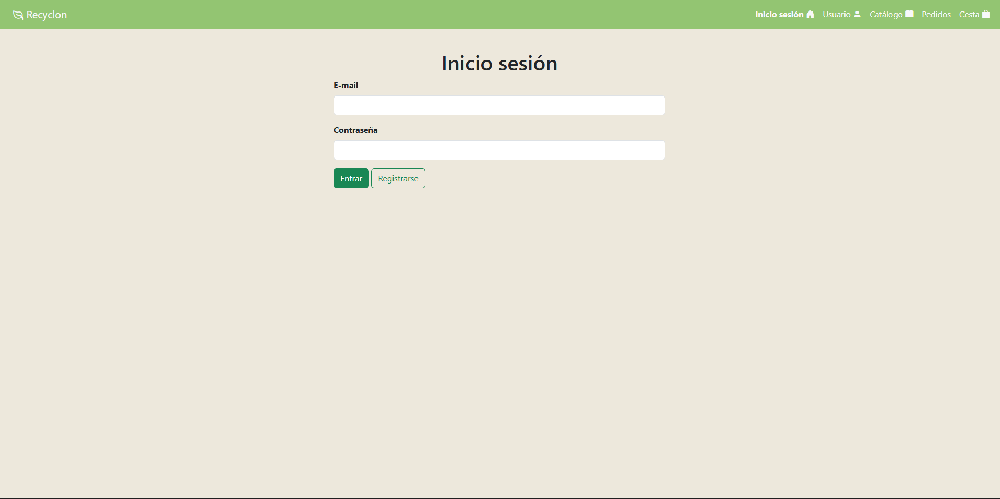
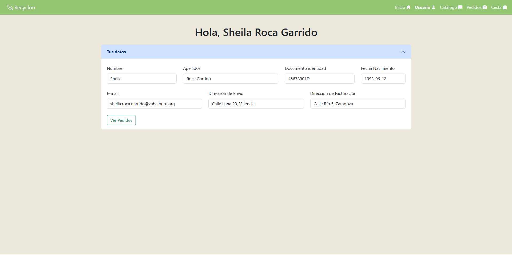
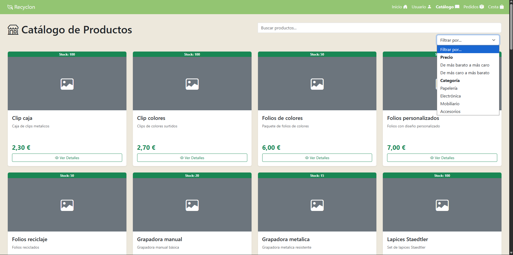
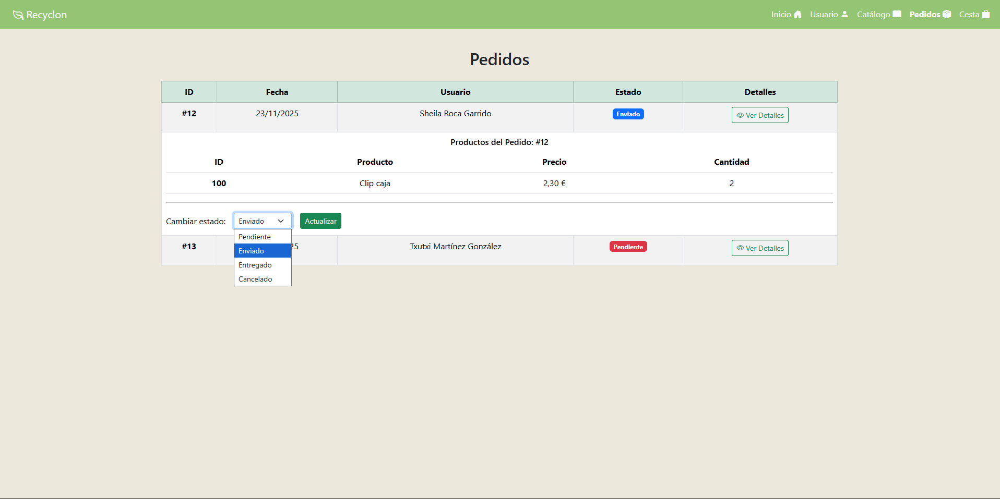

**Grupo DWES** – Proyecto desarrollado por:  
**Txutxi**, **Sheila** & **Belén**.

# **PROYECTO**
> Recyclon es una aplicación web que permite comprar y vender material de oficina de segunda mano.\
El objetivo es fomentar la economía circular y reducir el desperdicio en oficinas y colegios.

### **CARACTERISTICAS PRINCIPALES**
Hay dos tipos de usuario para esta aplicación: el usuario normal y el ususario administrador.\
El primero será un ususario que podra registrarse, navegar por la web y comprar productos.\
El segundo será un administrador de la web, encargado de revisar los pedidos y modificar el stock del producto.

### **PAGINAS**
**Usuario:** Aquí se veran los datos del ususario, con un acordeon con dos secciones siendo la primera la de mostrar datos y la segunda mostrará si tiene pedidos o no.\
        En caso de tenerlos se veran como una tabla siendo mostrados fecha e id y un boton para acceder al pedido.\
        Al clicar ese boton:\
         Hay que decidir:\
           1. Se abre abajo en la misma pantalla que hay espacio ese pedido en concreto?\
           2. Te deriva a otra pagina para mostrarte el pedido enconcreto?\
**Pedidos:** Aquí el administrador puede ver todos los pedidos, con su estado. podra filtrar por finalizados o pendientes, idUsuario.\
**Index:** Mostrara en pantalla l aopcion de registrarse o hacer login si ya estas registrado.\
**Productos:** En esta pantalla veremos los productos de dos maneras.\
          1.Si entras como admin: puedes hacer modificaciones en el stock (cambios de nº de unidades, cambios de nombres, fotos y descripciónes, añadir/eliminar producto.

### **TECNOLOGIAS UTILIZADAS**
**Frontend:** HTML5, CSS3, JavaScript\
**Backend:** Java\
**Base de datos:** SQL server\
**Control de versiones:** Git y GitHub

### **Capturas de las vistas principales**
**Inicio de Sesión**

**Usuario**

**Productos**

**Pedidos**

**Cesta**

